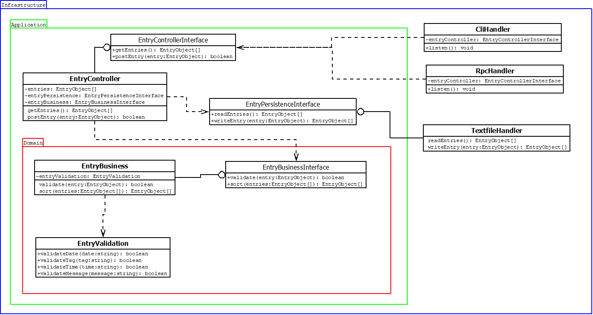

# Entrylogger
A program to log entries on a file, made in 2021 to learn more about clap, regex usage in Rust and the `Ord` trait. And to learn how to apply the dependency inversion principle using `Rc<dyn Trait>`.



Command usage:
```
$ entrylogger -p
date > today
time > now
tag > test
message > hello world
Message written.
```

entries.log example:
```
[ins:1708277097172 date:17-feb-24 time:morning tag:test] hello
[ins:1708276964913 date:18-feb-24 time:afternoon tag:test] hello world
```
